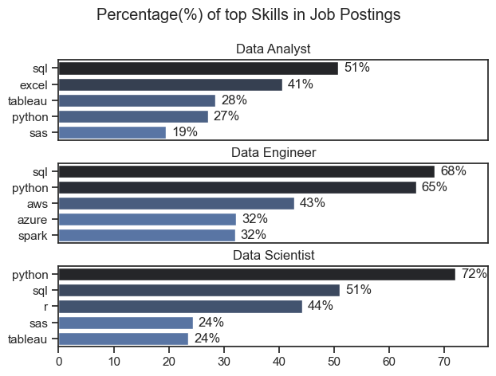
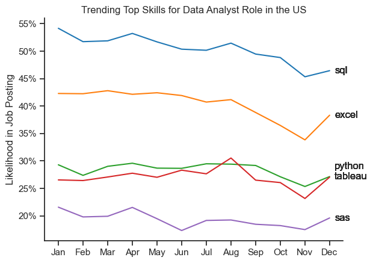
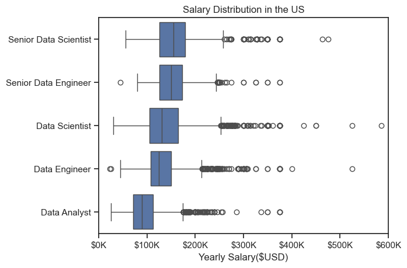
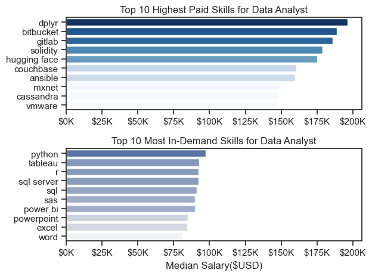
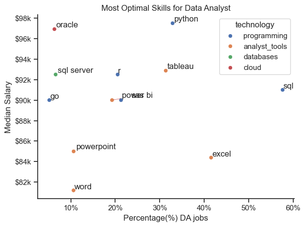

# Overview

This is a comprehensive Python-based data analysis toolkit designed to streamline skills and salary insights across job postings. It features:

- Data ingestion and preprocessing from job postings

- Skill analysis, frequency, and compensation mapping

- Advanced visualizations (e.g., scatter plots and bar charts) to highlight optimal skills for data analysts

- Utility modules for parsing, cleaning, and aggregating skill-related data

The data sourced from Luke Barousse's Python Course which provides a foundation for my analysis, containing detailed information on job titles, salaries, locations, and essential skills. Through a series of Python scripts, I explore key questions such as the most demanded skills, salary trends, and the intersection of demand and salary in data analytics.

# Key Features

- Skill Explosion & Aggregation

  Breaks down nested lists into individual skills, counts occurrences, calculates median salaries, and ranks skills by demand and compensation.

- Technology Dictionary Builder

  Parses string-formatted dicts into a unified structure linking job types to their unique associated skills.

- Interactive Visualizations

  Utilizes Seaborn and Matplotlib for scatter plots showing skill frequency vs. median salary; labels are optimized using adjustText.

# Tools I Used

#### Development Tools

     Visual Studio Code
     Git
     GitHub
     Jupiter Notebook

#### Python Libraries

    Pandas
    Seaborn
    Matplotlib
    AST (Abstract Syntax Trees)

# Questions

Below are the questions I want to answer in my project:

- What are the skills most in demand for the top 3 most popular data roles?
- How are in-demand skills trending for Data Analysts?
- How well do jobs and skills pay for Data Analysts?
- What are the optimal skills for data analysts to learn? (High Demand AND High Paying)

# The Analysis

## 1. What are the most demanded skills for the top 3 most popular data roles?

To find the most demanded skills for the top 3 most popular data roles. I filtered out those positions by which ones were the most popular, and got the top 5 skills for these top 3 roles. This query highlights the most popular job titles and their top skills, showing which skills I should pay attention to depending on the role I'm targeting.

View my notebook with detailed steps here: [2_Skills_Count.ipynb](Project/2_Skills_Count.ipynb)

### Visualize Data

```python
fig, ax = plt.subplots(len(job_titles),1)

sns.set_theme(style='ticks')
for i, job_title in enumerate(job_titles):

    df_plot = (df_skill_perc[df_skill_perc['job_title_short'] == job_title].head(5))

    sns.barplot(data=df_plot, x='skill_percent', y='job_skills', ax=ax[i], hue='skill_count', palette='dark:b_r')

    ax[i].set_title(job_title)
    ax[i].set_xlabel('')
    ax[i].set_ylabel('')
    ax[i].legend().set_visible(False)
    ax[i].set_xlim(0, 78)

    for n, v in enumerate(df_plot['skill_percent']):
        ax[i].text(v+1, n, f'{v:.0f}%', va='center')

    if i != len(job_titles)-1:
     ax[i].set_xticks([])

fig.suptitle('Percentage(%) of top Skills in Job Postings')
fig.tight_layout(h_pad=0.5)
```

### Results



### Insights

- SQL and Python are the most in-demand skills across all roles.
- Data Analysts often require Excel and Tableau alongside SQL.
- Data Engineers need strong cloud skills (AWS, Azure, Spark).
- Data Scientists heavily rely on Python, with R and SAS also in use.
- Role-specific tools vary, but foundational data skills remain key.

## 2. How are in-demand skills trending for Data Analysts?

### Visualize Data

```python

df_DA_plot = df_DA_us_percent.iloc[:, :5]
sns.lineplot(data=df_DA_plot, dashes=False, palette='tab10')
sns.set_theme(style='ticks')
sns.despine()
plt.title('Trending Top Skills for Data Analyst Role in the US')
plt.ylabel('Likelihood in Job Posting')
plt.xlabel('')
plt.legend().remove()

from matplotlib.ticker import PercentFormatter
ax= plt.gca()
ax.yaxis.set_major_formatter(PercentFormatter(decimals=0))

last_x = df_DA_plot.index[-1]
used_y = []

for i in range(5):
    last_x = df_DA_plot.index[-1]
    used_y = []

    for i in range(5):
        y = df_DA_plot.iloc[-1, i]

        while any(abs(y - used) < 1.5 for used in used_y):
            y += 1
        used_y.append(y)

        plt.text(11.2, y, df_DA_plot.columns[i], va='center')
```

### Results



### Insights

- SQL remains the most consistently demanded skill throughout the year, although it shows a gradual decline in percentage presence.
- Excel experiences a marked increase starting around September, eventually surpassing Python and Tableau by the end of the year.
- Python and Tableau display relatively stable demand with some minor fluctuations, maintaining their importance in data analyst roles.
- Sas, while less prominent compared to the others, exhibits a slight upward trend toward the year’s end.

## 3. How well do jobs and skills pay for Data Analysts?

To identify the highest-paying roles and skills, I only got jobs in the United States and looked at their median salary. But first I looked at the salary distributions of common data jobs like Data Scientist, Data Engineer, and Data Analyst, to get an idea of which jobs are paid the most.

View my notebook with detailed steps here: [4_Salary_Analysis](Project/4_Salary_Analysis.ipynb)

### Visualize Data

```python
sns.boxplot(data=df_us_top5, x='salary_year_avg', y='job_title_short', order=job_order)
sns.set_theme(style='ticks')

plt.title('Salary Distribution in the US')
plt.xlabel('Yearly Salary($USD)')
plt.ylabel('')
plt.xlim(0, 600000)
ticks_x = plt.FuncFormatter(lambda y, pos: f'${int(y/1000)}K')
plt.gca().xaxis.set_major_formatter(ticks_x)
plt.show()
```

### Results



### Insights

- Senior roles (Data Scientist/Engineer) earn significantly more, reaching up to $400K-$600K.
- Data Scientists show slightly higher top-end salaries than Data Engineers.
- Data Analysts have the lowest salary range among the roles.
- Wide IQR for senior roles indicates varied compensation.
- High-earning outliers suggest top performers earn exceptionally more.

## 3.1 Highest Paid & Most Demanded Skills for Data Analysts

### Visualize Data

```python
fig, ax = plt.subplots(2, 1)
sns.set_theme(style='ticks')
# --> Top 10 Highest Paid Skills for Data Analyst
sns.barplot(data=df_DA_top_pay, x='median', y=df_DA_top_pay.index, ax=ax[0], hue='median', palette='Blues')
ax[0].legend().remove()
```

### Results



### Insights

- Highest Paid Skills are niche/emerging technologies (e.g., dplyr, Hugging Face, Solidity), suggesting specialized expertise commands premium salaries
- Most In-Demand Skills are foundational tools (e.g., Python, SQL, Excel), reflecting broader industry needs for core data analysis competencies.
- Niche skills (e.g., Cassandra, VMware) show higher median salaries (up to $175K+), while mainstream tools (e.g., Excel, PowerPoint) likely fall in the $50K–$100K range.
- Specialization pays: Expertise in less common tools (e.g., MXNet, Ansible) correlates with higher earnings.
- AI/ML tools (e.g., Hugging Face, MXNet) appear in high-paid skills, signaling demand for AI-integrated analytics.
- Database/DevOps skills (e.g., Couchbase, GitLab) are both high-paid and in-demand, highlighting the overlap between data analysis and engineering roles.
- For job opportunities: Master staples like Python, Tableau, and SQL, which dominate demand despite lower pay ceilings.

## 4. What are the most optimal skills to learn for Data Analysts?

### Visualize Data

```python
from adjustText import adjust_text

sns.scatterplot(
    data=df_plot,
    x='skill_percent',
    y='median_salary',
    hue='technology'
)
sns.despine()
sns.set_theme(style='ticks')
texts = []

for i, txt in enumerate(df_DA_skills_high_demand.index):
    texts.append(plt.text(df_DA_skills_high_demand['skill_percent'].iloc[i], df_DA_skills_high_demand['median_salary'].iloc[i], txt))

adjust_text(texts, arrowprops=dict(arrowstyle='->', color='r', lw=0.5))


from matplotlib.ticker  import PercentFormatter
ax= plt.gca()
ax.xaxis.set_major_formatter(PercentFormatter(decimals=0))
ax.yaxis.set_major_formatter(plt.FuncFormatter(lambda y, pos: f'${int(y/1000)}k'))

plt.xlabel('Percentage(%) DA jobs')
plt.ylabel('Median Salary')
plt.title('Most Optimal Skills for Data Analyst')
plt.tight_layout()
plt.show()
```

### Results



### Insights

- Python, SQL, and Tableau are the most optimal skills — they offer both high demand and strong salaries.
- Excel is widely required but offers lower salaries — it's essential but not a salary booster.
- Power BI, R, and SQL Server strike a good balance between demand and pay — solid secondary skills.
- Tools like Oracle and Go offer high salaries but are less in demand — useful for niche roles.
- Word and PowerPoint have low value — low demand and low salary impact. Avoid focusing on them.

# Conclusion

This project transforms raw job listing data into practical insights for aspiring data analysts. It highlights which skills are most valuable to learn — those that combine strong demand with high compensation. The analysis empowers users to make informed decisions about skill development based on current market data.
